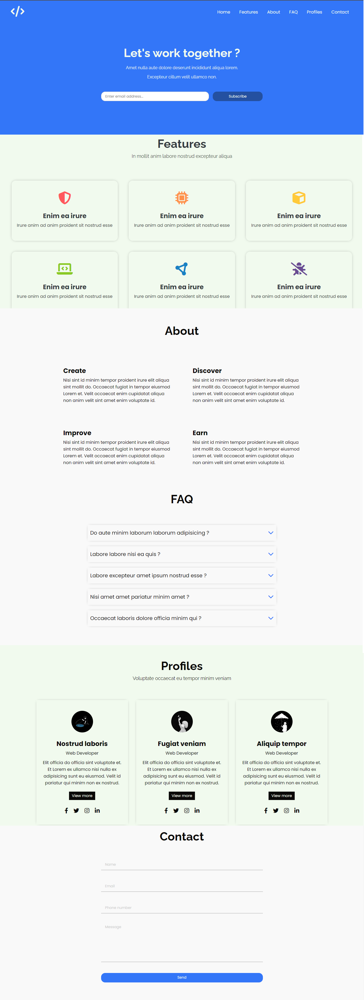

# Code Landing Page

Bem-vindo à página inicial da Code Landing! Esta página foi criada como uma landing page para uma empresa de tecnologia fictícia que fornece serviços de programação.



# Recursos
Esta página possui os seguintes recursos:

- Design responsivo que se adapta a diferentes tamanhos de tela.
- Barra de navegação com links para diferentes seções da página.
- Seção Features que destaca as principais funcionalidades que a empresa oferece. Cada recurso é acompanhado por um ícone e uma breve descrição
- Seção About com informações sobre a Code Landing Page.
- Seção FAQ com uma lista de perguntas e respostas comuns sobre a empresa e seus serviços. 
- Seção Profiles com informações sobre algumas das pessoas que trabalham na Code Landing Page.
- Seção Contact com um formulário para entrar em contato com a Code Landing Page.

# Tecnologias
Esta página foi construída utilizando as seguintes tecnologias:

- HTML5
- CSS3
- JavaScript
- jQuery

# Utilização

Para utilizar a Code Landing Page na sua máquina siga os seguintes passos:

- Clone o repositório para sua máquina local utilizando o seguinte comando:
```bash
  git clone https://github.com/ViniciusQuintas/Code-Landing-Page.git
```
- Após clonar o repositório, navegue até o diretório da Code Landing Page no terminal:
```bash
  cd Code-Landing-Page
```
- Agora, abra o arquivo index.html no seu navegador para visualizar a Code Landing Page em ação.

# Contribuição
Se você deseja contribuir para o desenvolvimento Code Landing page, siga os seguintes passos:

1️⃣ Faça um fork deste repositório. 
<br>
<br>
2️⃣ Crie uma nova branch para sua contribuição. 
<br>
<br>
3️⃣ Faça suas alterações no código. 
<br>
<br>
4️⃣  Certifique-se de que suas alterações não quebram o funcionamento existente da página. 
<br>
<br>
5️⃣ Faça um pull request com suas alterações. 
<br>
<br>

# Licença
Este projeto está licenciado sob a Licença MIT. Consulte o arquivo LICENSE para obter mais informações.
